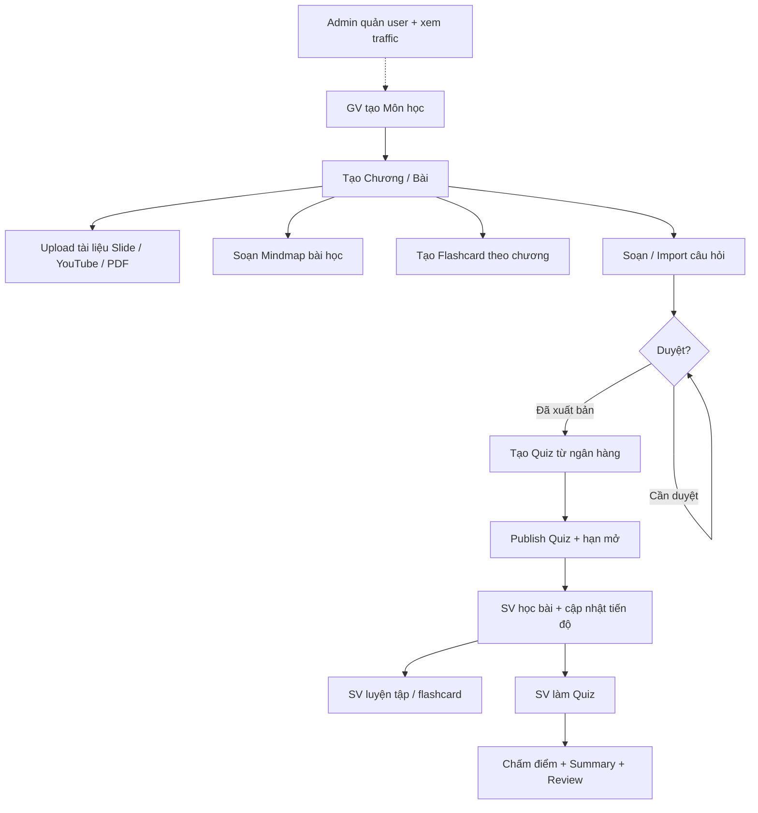

# Tính năng, chức năng & luồng nghiệp vụ

Tài liệu mô tả toàn bộ tính năng sản phẩm **Học LLCT** (Marx–Lenin / Lý luận chính trị), phân theo vai trò người dùng và các luồng nghiệp vụ xuyên suốt.

> Nguồn: mã nguồn Frontend (`Frontend/app`) + Backend API (`Backend/.../controller`). Cập nhật theo trạng thái codebase hiện tại.

---

## Mục lục

1. [Tổng quan hệ thống](#1-tổng-quan-hệ-thống)
2. [Vai trò & phân quyền](#2-vai-trò--phân-quyền)
3. [Bản đồ route](#3-bản-đồ-route)
4. [Tính năng theo module](#4-tính-năng-theo-module)
5. [Luồng nghiệp vụ chính](#5-luồng-nghiệp-vụ-chính)
6. [Trạng thái & quy tắc nghiệp vụ](#6-trạng-thái--quy-tắc-nghiệp-vụ)
7. [API Backend (tóm tắt)](#7-api-backend-tóm-tắt)
8. [Mô hình dữ liệu nghiệp vụ](#8-mô-hình-dữ-liệu-nghiệp-vụ)

---

## 1. Tổng quan hệ thống

Nền tảng học tập trực tuyến cho môn lý luận chính trị với 3 vai trò:

| Vai trò | Mục tiêu chính |
|--------|----------------|
| **Sinh viên (student)** | Học bài giảng, ôn flashcard, luyện tập, làm kiểm tra, xem mindmap |
| **Giáo viên (teacher)** | Quản lý cấu trúc khóa học, tài liệu, ngân hàng câu hỏi, quiz, flashcard, mindmap |
| **Quản trị (admin)** | Quản lý người dùng, xem lưu lượng truy cập; có thể vào khu vực teacher |

**Stack nghiệp vụ chính**

- Đăng nhập Google OAuth → JWT theo role
- Nội dung học theo cây: **Môn (Subject) → Chương (Chapter) → Bài (Lesson) → Tài liệu (Material)**
- Ngân hàng câu hỏi → ghép thành Quiz → sinh viên làm bài → chấm điểm → tổng kết / xem lại
- Theo dõi tiến độ học bài; analytics page-view + presence (online)

---

## 2. Vai trò & phân quyền

### 2.1 Role

| Role FE | Role BE | Home sau login |
|---------|---------|----------------|
| `student` | `STUDENT` | `/student` |
| `teacher` | `TEACHER` | `/teacher` |
| `admin` | `ADMIN` | `/admin` |

### 2.2 Quy tắc truy cập UI

- Chưa đăng nhập vào route bảo vệ → `/login` (giữ `from` để quay lại sau nếu hợp lệ).
- Sai role → toast thông báo + chuyển về dashboard đúng role.
- **Admin** được vào `/admin/*` **và** `/teacher/*`.
- Teacher/Student không vào khu vực của nhau.

### 2.3 Quy tắc truy cập API (SecurityConfig)

| Path | Ai được gọi |
|------|-------------|
| `/api/auth/**` | Public |
| `POST /api/analytics/page-views` | Public |
| `/api/admin/**` | ADMIN |
| `/api/teacher/**` | TEACHER, ADMIN (một số GET flashcard cho cả STUDENT) |
| `/api/student/**` | STUDENT |
| Mutate chapters / lessons / materials / mindmap | TEACHER, ADMIN |
| Còn lại (đã auth) | User đã đăng nhập |

---

## 3. Bản đồ route

```
/                                  Landing (welcome)
/login                             Đăng nhập Google
/auth/callback                     Nhận token OAuth → lưu session → redirect theo role

/admin                             Quản lý người dùng
/admin/traffic                     Thống kê lưu lượng

/student                           Dashboard môn học + tiến độ
/student/courses/:courseId         Học khóa (4 tab)
/student/courses/:courseId/practice
/student/courses/:courseId/exams/:quizId
/student/.../summary/:attemptId
/student/.../review/:attemptId
/student/chapters/:chapterId/flashcards
/student/lessons/:lessonId/mindmap

/teacher                           Overview giảng dạy
/teacher/courses                   Danh sách môn học
/teacher/courses/:subjectId        Cấu trúc chương → bài → tài liệu
/teacher/pdfs                      Quản lý PDF
/teacher/flashcards                Bộ flashcard theo chương
/teacher/flashcards/new            Tạo / import flashcard
/teacher/questions                 Ngân hàng câu hỏi
/teacher/quizzes                   Quản lý quiz
/teacher/lessons/:lessonId/mindmap Soạn mindmap bài học

/*                                 404
```

Redirect alias: `/student/dashboard` → `/student`, `/teacher/dashboard` → `/teacher`, `/admin/dashboard` → `/admin`.

---

## 4. Tính năng theo module

### 4.1 Welcome (Landing) — `/`

**Mục đích:** Giới thiệu sản phẩm, dẫn người dùng đăng nhập / vào học.

**Chức năng**

- Hero thương hiệu + CTA đăng nhập / học
- Giới thiệu nội dung LLCT, timeline tư tưởng
- Preview tính năng (quiz, tài liệu, knowledge graph…)
- SEO: `sitemap.xml`, `robots.txt`

---

### 4.2 Auth — Đăng nhập & phiên

**Mục đích:** Xác thực Google, tạo phiên theo role.

**Chức năng**

| Chức năng | Mô tả |
|-----------|--------|
| Lấy URL Google login | `GET /api/auth/google/url` |
| OAuth callback | Đổi code → user info → find/create user → JWT → redirect FE |
| Lưu session | token, role, userId, name, email, avatar |
| Validate token | `POST /api/auth/validate-token` |
| Logout | Xóa session phía client |
| Auto-redirect | User đã login vào `/login` → về home theo role |

**Luồng đăng nhập**

```
User bấm “Đăng nhập Google”
  → FE lấy redirect URL
  → Google OAuth
  → BE /api/auth/google/callback
  → findOrCreateUser (role theo email / mặc định student)
  → JWT
  → Redirect /auth/callback?token&role&...
  → FE lưu session
  → Redirect /student | /teacher | /admin
```

Lỗi OAuth → `/login?error=oauth_failed`.

---

### 4.3 Admin

#### 4.3.1 Quản lý người dùng — `/admin`

| Chức năng | Mô tả |
|-----------|--------|
| Danh sách user | Tìm theo tên/email/username, lọc role, phân trang |
| Tạo user | Email, họ tên, role, `isActive` |
| Sửa user | Cập nhật thông tin / role / trạng thái |
| Xóa user | Xóa khỏi hệ thống |
| Trạng thái online | Hiển thị online / `lastSeenAt` (từ presence) |

#### 4.3.2 Lưu lượng truy cập — `/admin/traffic`

| Chức năng | Mô tả |
|-----------|--------|
| Tổng quan | Tổng page view, hôm nay/hôm qua, unique viewers, đang online |
| Biểu đồ theo ngày | Khoảng 7 / 14 / 30 ngày |
| Trang phổ biến | Top path theo lượt xem |
| User online | Danh sách hoạt động gần đây |

**Nền tảng analytics (ngầm trên mọi trang)**

- Ghi page view (`POST /api/analytics/page-views`) — viewer key localStorage
- Presence heartbeat ~60s (`POST /api/presence/heartbeat`)
- “Online” ≈ hoạt động trong **5 phút**

---

### 4.4 Teacher — Tổng quan — `/teacher`

| Chức năng | Mô tả |
|-----------|--------|
| Metrics strip | Số môn, flashcard, thống kê câu hỏi & quiz |
| Câu hỏi gần đây | Lọc search / độ khó / trạng thái + phân trang |

**Menu chính:** Dashboard · Cấu trúc khóa học · Tài liệu PDF · Flashcard · Ngân hàng câu hỏi · Quản lý Quiz

---

### 4.5 Teacher — Cấu trúc khóa học

#### Danh sách môn — `/teacher/courses`

| Chức năng | Mô tả |
|-----------|--------|
| Xem danh sách môn | Subject: code, title, description |
| Tạo / sửa / xóa môn | CRUD Subject |

#### Chi tiết môn — `/teacher/courses/:subjectId`

Cây nội dung: **Chương → Bài học → Tài liệu**

| Đối tượng | Chức năng |
|-----------|-----------|
| **Chương** | Tạo, sửa tên, xóa (cascade bài + tài liệu) |
| **Bài học** | Tạo, sửa, xóa |
| **Tài liệu** | Tạo slide deck (upload) hoặc YouTube; preview; sửa metadata; xóa; thay bộ slide |

**Loại tài liệu:** `SLIDE_DECK` | `YOUTUBE`

#### Tài liệu PDF — `/teacher/pdfs`

| Chức năng | Mô tả |
|-----------|--------|
| Upload PDF | Gắn với bài học + title |
| Danh sách / tìm kiếm | Lọc PDF trong hệ thống |
| Xóa | Gỡ tài liệu PDF |

#### Mindmap bài học (GV) — `/teacher/lessons/:lessonId/mindmap`

| Chức năng | Mô tả |
|-----------|--------|
| Soạn đồ thị | Thêm/sửa/xóa node–edge (React Flow) |
| Layout / undo | Layout radial, undo |
| Import JSON | Cây AI hoặc flat React Flow |
| Lưu | Persist mindmap theo bài / course |

**Vai trò node:** root · chapter · concept · timeline · example · quote

---

### 4.6 Teacher — Flashcard

| Route | Chức năng |
|-------|-----------|
| `/teacher/flashcards` | Danh sách bộ thẻ theo chương; CRUD thẻ (term / definition) |
| `/teacher/flashcards/new` | Tạo bộ thẻ mới / import hàng loạt (bulk) |

API: list sets, list cards theo chapter, create, bulk create, update, delete.

---

### 4.7 Teacher — Ngân hàng câu hỏi — `/teacher/questions`

**Mục đích:** Kho câu hỏi trung tâm cho luyện tập & quiz.

#### Thuộc tính câu hỏi

| Thuộc tính | Giá trị |
|------------|---------|
| Loại | Trắc nghiệm · Nhiều đáp án · Đúng/Sai · Điền khuyết · Tự luận |
| Độ khó | Cơ bản · Vận dụng · Nâng cao |
| Bloom | Nhận biết → Đánh giá (ví dụ: Hiểu…) |
| Phạm vi | Môn / Chương / Bài |
| Status | Bản nháp → Cần duyệt → Đã xuất bản |

#### Chức năng

| Chức năng | Mô tả |
|-----------|--------|
| Danh sách + lọc | Search, môn/chương/bài, độ khó, loại, status; phân trang |
| Stats | Theo độ khó & status (click lọc nhanh) |
| Tạo / sửa | Editor metadata + đáp án |
| Kiểm tra trùng | Exact / similar trước khi lưu |
| Duyệt 1 câu | Approve → Đã xuất bản |
| Duyệt hàng loạt | Bulk approve |
| Xóa 1 / nhiều | Delete theo id hoặc danh sách ids |
| Import Excel | Upload → map cột → preview → batch import (skip trùng, đánh dấu tương tự) |
| Xuất đề / random | Random theo tỷ lệ độ khó + scope → lưu quiz nháp hoặc xuất Wayground Excel |

#### Quy tắc quan trọng

- Trắc nghiệm cần ≥ 1 đáp án đúng; nhiều đáp án ≥ 2.
- Sửa câu **đã xuất bản** rồi publish lại → có thể đưa về **Cần duyệt**.
- Import timeout dài (tới ~10 phút); có thể vẫn chạy trên server.

---

### 4.8 Teacher — Quản lý Quiz — `/teacher/quizzes`

**Status quiz:** Bản nháp (`DRAFT`) · Đã xuất bản (`PUBLISHED`) · Đã tắt (`CLOSED`)

#### View

- **List:** danh sách + filter search / môn / status + stats
- **Editor:** tab Cài đặt · Câu hỏi · Xuất bản

#### Cài đặt quiz

- Title, phạm vi môn/chương/bài
- Thời lượng làm bài
- Điểm đạt (mặc định thường 70)
- Số câu random, shuffle đáp án, random câu
- `availableUntil` (hạn mở)

#### Chức năng

| Chức năng | Mô tả |
|-----------|--------|
| Tạo / sửa / xóa | CRUD quiz |
| Chọn câu từ ngân hàng | Candidate questions (lọc search/độ khó/scope) |
| Generate random | Lấy pool theo scope + tỷ lệ độ khó |
| Publish | Xuất bản cho sinh viên |
| Duplicate | Nhân bản |
| Close / mở lại | Tắt quiz (`CLOSED`) |
| Import đề Excel | Import → quiz bản nháp |

#### Quy tắc

- Sửa danh sách câu → mất trạng thái published cho đến khi publish lại.
- Sinh viên chỉ thấy quiz **đã xuất bản** và trong cửa sổ thời gian (ongoing vs upcoming).

---

### 4.9 Student — Dashboard — `/student`

| Chức năng | Mô tả |
|-----------|--------|
| Danh sách môn | Các subject có trong hệ thống |
| % hoàn thành | Theo tiến độ bài học |
| Học tiếp / Vào học | Deep-link chapter/lesson (resume) hoặc vào khóa |
| Tài khoản | Logout / menu |

---

### 4.10 Student — Học khóa học — `/student/courses/:courseId`

Bốn tab chính:

| Tab | Chức năng |
|-----|-----------|
| **Bài giảng** | Chương → bài → tài liệu; xem slide / YouTube; điều hướng bài; curriculum sidebar / sheet mobile |
| **Flashcard** | Catalog bộ thẻ theo chương → vào học |
| **Luyện tập** | Setup & vào phiên luyện tập |
| **Kiểm tra** | Catalog quiz: đang mở / sắp tới / đã làm |

**Deep-link query:** `tab`, `chapter`, `lesson`, `material`

#### Tiến độ học (Student Progress)

| Status | Ý nghĩa |
|--------|---------|
| `NOT_STARTED` | Chưa học |
| `IN_PROGRESS` | Đang học |
| `COMPLETED` | Đã hoàn thành |

**Quy tắc cập nhật (UI)**

- **Slide:** mở → `IN_PROGRESS`; tới slide cuối → `COMPLETED`
- **YouTube:** mở xem → thường coi như `COMPLETED`
- **Resume:** bài `IN_PROGRESS` gần nhất; nếu vừa `COMPLETED` thì gợi ý bài chưa xong tiếp theo

API: get/update progress theo lesson; list theo chapter/course; get resume point.

---

### 4.11 Student — Luyện tập — `/student/courses/:courseId/practice`

**Mục đích:** Ôn trắc nghiệm **không tính điểm chính thức**, feedback ngay.

**Luồng**

```
Setup (phạm vi môn/chương/bài, số câu, auto-advance)
  → Lấy practice questions từ API
  → Session: random câu, chọn đáp án, feedback đúng/sai, timer
  → Thống kê đúng/sai trong phiên
```

**Quy tắc**

- Scope: cả môn / theo chương / theo bài
- Batch mặc định ~30 câu; câu cần ≥ 2 lựa chọn
- Hỗ trợ single & multi-select; có thể auto-advance sau N giây
- Không tạo attempt chính thức như quiz

---

### 4.12 Student — Kiểm tra (Exam / Quiz)

| Route | Chức năng |
|-------|-----------|
| Tab Kiểm tra | Catalog: ongoing / upcoming (khóa) / completed |
| `.../exams/:quizId` | Làm bài: timer, chọn đáp án, draft local, xác nhận nộp, **auto-submit hết giờ** |
| `.../summary/:attemptId` | Tổng kết: điểm, đạt/trượt, breakdown độ khó, gợi ý cải thiện theo chủ đề |
| `.../review/:attemptId` | Xem lại từng câu (đáp án đúng / đã chọn) |

**Luồng làm bài**

```
Chọn quiz (ongoing)
  → GET session (câu hỏi đã random/shuffle theo cấu hình)
  → Làm bài + đếm giờ phía client
  → Submit (manual hoặc hết giờ)
      body: elapsedSeconds, questionIds, answers
  → Server chấm điểm, lưu attempt
  → Redirect summary
  → (tuỳ chọn) Review chi tiết
```

**Quy tắc**

- Cần đăng nhập (student)
- Pass theo `passingScore` của quiz
- Bài trượt có thể **làm lại** (retake) tùy catalog
- Upcoming: chưa tới giờ mở → không vào session

---

### 4.13 Student — Flashcard — `/student/chapters/:chapterId/flashcards`

| Chức năng | Mô tả |
|-----------|--------|
| Lật thẻ | Term ↔ definition |
| Điều hướng | Trước / sau, xáo trộn |
| Đã thuộc | Đánh dấu mastered |
| TTS | Đọc nội dung thẻ |
| Reset | Xóa tiến độ ôn |
| Catalog | Danh sách từ vựng trong bộ |

**Lưu ý:** Mastered + index lưu **localStorage** theo user + chapter (phía client).

---

### 4.14 Student — Mindmap — `/student/lessons/:lessonId/mindmap`

| Chức năng | Mô tả |
|-----------|--------|
| Xem sơ đồ | Chỉ đọc (không lưu) |
| Collapse / expand | Thu–mở node theo cấp |
| Focus node | Điều hướng trên graph |
| Xuất PNG | Export ảnh |

---

### 4.15 Knowledge Graph (shared)

Hai lớp:

1. **Course-level API:** `GET/POST /api/v1/courses/{courseId}/mindmap`
2. **Lesson-level UI:** soạn/xem mindmap gắn bài học (teacher edit / student view)

---

## 5. Luồng nghiệp vụ chính

### 5.1 Luồng chuẩn “Từ nội dung → kiểm tra”



### 5.2 Luồng Auth

```
Landing / Login
  → Google OAuth
  → BE tạo/cập nhật User + JWT
  → FE session theo role
  → Dashboard tương ứng
```

### 5.3 Luồng quản lý câu hỏi

```
Tạo tay / Import Excel
  → (optional) Check duplicate
  → Status: DRAFT hoặc PENDING
  → Approve (1 hoặc bulk)
  → PUBLISHED
  → Dùng cho Practice pool & Quiz candidates
```

### 5.4 Luồng quản lý quiz

```
Tạo nháp
  → Chọn câu thủ công / random / import đề
  → Cấu hình thời gian, điểm đạt, shuffle…
  → Publish
  → (tuỳ chọn) Close khi hết đợt
  → Duplicate để tái sử dụng
```

### 5.5 Luồng học của sinh viên

```
Dashboard → chọn môn (hoặc “Học tiếp”)
  → Tab Bài giảng: xem slide/YouTube → cập nhật progress
  → Tab Flashcard: ôn theo chương
  → Tab Luyện tập: feedback ngay
  → Tab Kiểm tra: làm quiz → summary → review
  → Mindmap: xem sơ đồ tư duy bài học
```

### 5.6 Luồng giám sát (Admin)

```
Mọi trang ghi page-view + heartbeat
  → Admin /traffic xem thống kê
  → Admin / quản lý CRUD user + theo dõi online
```

---

## 6. Trạng thái & quy tắc nghiệp vụ

### 6.1 Câu hỏi (`QuestionConstant`)

| Code | Label UI |
|------|----------|
| `DRAFT` | Bản nháp |
| `PENDING` | Cần duyệt |
| `PUBLISHED` | Đã xuất bản (UI đôi khi hiện “Đã duyệt”) |

### 6.2 Quiz (`QuizConstant`)

| Code | Label UI |
|------|----------|
| `DRAFT` | Bản nháp |
| `PUBLISHED` | Đã xuất bản |
| `CLOSED` | Đã tắt |

Public ID dạng `QZ-{id}`.

### 6.3 Tiến độ học (`StudentProgressConstant`)

| Code | Ý nghĩa |
|------|---------|
| `NOT_STARTED` | Chưa bắt đầu |
| `IN_PROGRESS` | Đang học |
| `COMPLETED` | Hoàn thành |

### 6.4 Catalog quiz phía sinh viên

| Slot | Ý nghĩa |
|------|---------|
| `ongoing` | Đang mở, có thể vào làm |
| `upcoming` | Chưa tới giờ / chưa mở |
| `completed` | Đã có attempt; có thể xem lại / retake nếu cho phép |

### 6.5 Phân quyền đường dẫn FE

| Khu vực | Role được phép |
|---------|----------------|
| `/admin` | admin |
| `/student` | student |
| `/teacher` | teacher **hoặc** admin |

---

## 7. API Backend (tóm tắt)

### Auth & nền tảng

| Nhóm | Endpoint chính |
|------|----------------|
| Auth | Google URL, callback, validate-token |
| Analytics | POST page-views; GET admin traffic |
| Presence | POST heartbeat |

### Nội dung học

| Controller | Chức năng |
|------------|-----------|
| Subject | CRUD môn học |
| Chapter | CRUD chương theo môn |
| Lesson | CRUD bài theo chương |
| Material | CRUD tài liệu, PDF, thay slides |
| KnowledgeGraph | Get/save mindmap theo course |

### Teacher

| Controller | Chức năng |
|------------|-----------|
| QuestionLibrary | CRUD, approve, bulk, import, duplicate-check, stats |
| QuizManagement | CRUD, publish, duplicate, close, import-exam, candidates |
| TeacherFlashcard | Sets theo chapter, CRUD / bulk cards |

### Student

| Controller | Chức năng |
|------------|-----------|
| StudentQuiz | Catalog, session, submit, summary, review |
| StudentPractice | List / count practice questions |
| StudentProgress | Get/update progress, list by chapter/course, resume |

### Admin

| Controller | Chức năng |
|------------|-----------|
| AdminUser | CRUD users |

---

## 8. Mô hình dữ liệu nghiệp vụ

Các thực thể chính và quan hệ:

```
User (role: ADMIN | TEACHER | STUDENT)
  │
Subject (môn học)
  └── Chapter
        ├── Lesson
        │     ├── Material (SLIDE_DECK / YOUTUBE) → Slide[]
        │     ├── Question → Answer[], Tag[]
        │     ├── KnowledgeGraphNode / Edge (mindmap)
        │     └── StudentProgress (student × lesson)
        └── Flashcard[] (+ FlashcardProgress)

Quiz (scope môn/chương/bài, status, settings)
  ├── QuizQuestion → Question
  └── QuizAttempt (student)
        ├── QuizAttemptQuestion
        └── QuizAttemptDetail

PageView (analytics)
```

---

## Phụ lục A — Checklist tính năng theo persona

### Sinh viên

- [x] Đăng nhập Google
- [x] Dashboard môn + % tiến độ + resume
- [x] Học slide / YouTube theo chương–bài
- [x] Cập nhật tiến độ bài học
- [x] Ôn flashcard theo chương
- [x] Luyện tập có feedback ngay
- [x] Làm quiz có giờ, nộp, summary, review
- [x] Xem mindmap bài học

### Giáo viên

- [x] Dashboard tổng quan
- [x] CRUD môn / chương / bài / tài liệu / PDF
- [x] Mindmap soạn thảo
- [x] Flashcard CRUD + bulk
- [x] Ngân hàng câu hỏi (CRUD, duyệt, import, check trùng, xuất đề)
- [x] Quản lý quiz (CRUD, publish, close, duplicate, import)

### Admin

- [x] CRUD người dùng
- [x] Xem traffic & online users
- [x] Vào được khu vực teacher

### Hệ thống

- [x] Protected routes theo role
- [x] Page-view + presence heartbeat
- [x] Toast & thanh tiến trình async cho thao tác dài

---

## Phụ lục B — File tham chiếu nhanh

| Mục | Path |
|-----|------|
| Khai báo route | `Frontend/app/routes.ts` |
| Phân quyền path | `Frontend/app/shared/constants/route-access.ts` |
| Guard UI | `Frontend/app/shared/components/protected-route.tsx` |
| Checklist route teacher | `AGENTS-TEACHER-ROUTES.md` |
| Design UI | `DESIGN.md` |
| Controllers | `Backend/src/main/java/com/sed10/mln/study/controller/` |

---

*Tài liệu này mô tả hành vi nghiệp vụ hiện có trong codebase; khi thêm feature mới nên cập nhật đồng bộ file này.*
`)